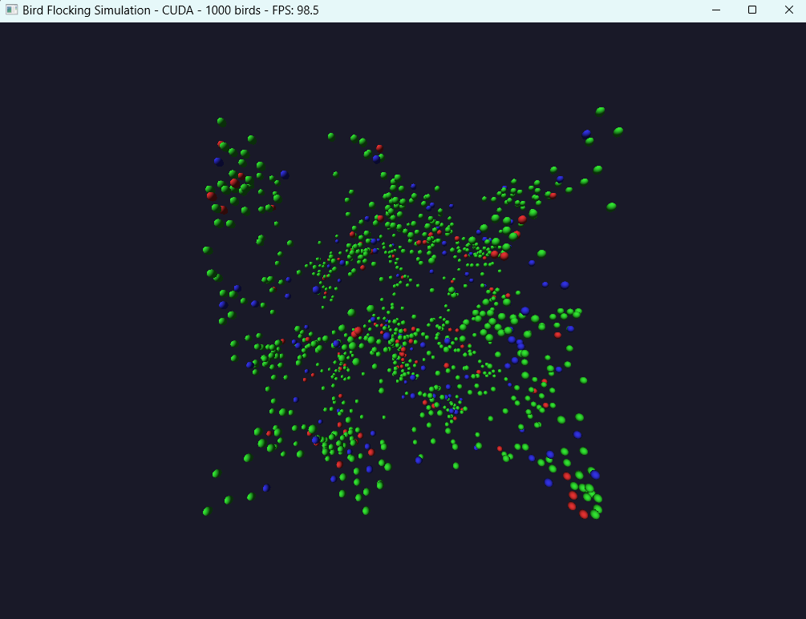
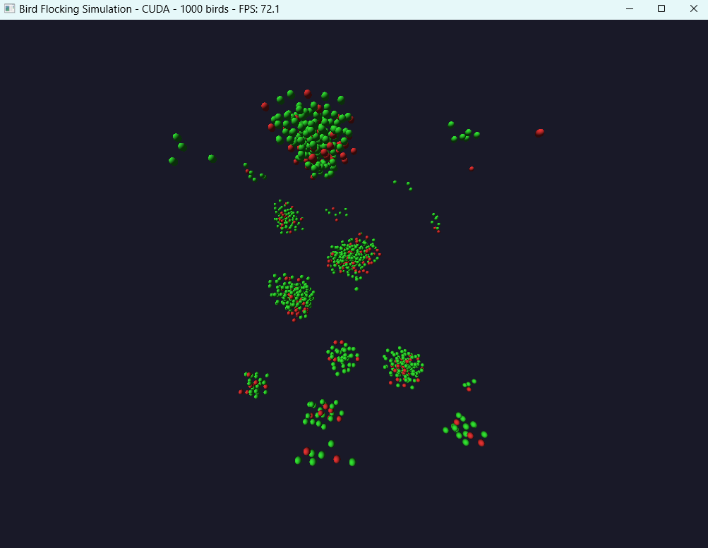

# cuda bird flocking
 Bird flocking simulation in CUDA



When running the visual simulation, bird colour indicates the strongest force:

- Red = Separation
- Blue = Alignment
- Green = Cohesion

## Basic Commands

For regular visualization with FPS tracking:
```sh
BirdSim.exe
```
For raw computational benchmark of steps without graphics:
```sh
BirdSim.exe benchmark                  # Default: 200 birds, 1000 steps
BirdSim.exe benchmark 500              # 500 birds, 1000 steps
BirdSim.exe benchmark 500 2000         # 500 birds, 2000 steps
```

For scaling analysis across different flock sizes:
```sh
BirdSim.exe scaling
```

**NOTE: MAX BIRD COUNT IS 5000**

## Scaling example

```
PS C:\Users\Willy\Documents\Jayden\GitHub\cuda-bird-flocking\BirdSim\x64\Release> .\BirdSim.exe scaling
GPU Device 0: "Ada" with compute capability 8.9

CUDA device [NVIDIA GeForce RTX 4070 Ti SUPER] has 66 Multi-Processors
Running scaling test with various flock sizes
Running scaling test with various flock sizes...

=== Testing with 100 birds ===
Simulation initialized with 100 birds
Running benchmark for 100 birds with 500 steps...
Completed 100 steps (20.0%)
Completed 200 steps (40.0%)
Completed 300 steps (60.0%)
Completed 400 steps (80.0%)
Completed 500 steps (100.0%)

=== Performance Report ===
Total steps: 500
Total time: 0.049 seconds
Steps per second: 10142.5
Time breakdown:
  - Force calculations: 0.018s (36.9%)
  - Position updates: 0.011s (21.9%)
  - Other/overhead: 0.020s (41.2%)
=========================

=== Testing with 500 birds ===
Simulation initialized with 500 birds
Running benchmark for 500 birds with 500 steps...
Completed 100 steps (20.0%)
Completed 200 steps (40.0%)
Completed 300 steps (60.0%)
Completed 400 steps (80.0%)
Completed 500 steps (100.0%)

=== Performance Report ===
Total steps: 500
Total time: 0.074 seconds
Steps per second: 6730.5
Time breakdown:
  - Force calculations: 0.042s (57.1%)
  - Position updates: 0.011s (14.6%)
  - Other/overhead: 0.021s (28.3%)
=========================

=== Testing with 1000 birds ===
Simulation initialized with 1000 birds
Running benchmark for 1000 birds with 500 steps...
Completed 100 steps (20.0%)
Completed 200 steps (40.0%)
Completed 300 steps (60.0%)
Completed 400 steps (80.0%)
Completed 500 steps (100.0%)

=== Performance Report ===
Total steps: 500
Total time: 0.107 seconds
Steps per second: 4674.4
Time breakdown:
  - Force calculations: 0.074s (69.2%)
  - Position updates: 0.011s (10.4%)
  - Other/overhead: 0.022s (20.5%)
=========================

=== Testing with 5000 birds ===
Simulation initialized with 5000 birds
Running benchmark for 5000 birds with 500 steps...
Completed 100 steps (20.0%)
Completed 200 steps (40.0%)
Completed 300 steps (60.0%)
Completed 400 steps (80.0%)
Completed 500 steps (100.0%)

=== Performance Report ===
Total steps: 500
Total time: 0.345 seconds
Steps per second: 1447.4
Time breakdown:
  - Force calculations: 0.306s (88.5%)
  - Position updates: 0.014s (4.0%)
  - Other/overhead: 0.026s (7.5%)
=========================
```

## Visualisation Over Time

Just an example of the visualisation running for about a minute or so.

```
GPU Device 0: "Ada" with compute capability 8.9

CUDA device [NVIDIA GeForce RTX 4070 Ti SUPER] has 66 Multi-Processors
Starting visualization with 1000 birds...
Simulation initialized with 1000 birds

Controls:
ESC - Exit

Fixed weights:
Separation: 1.0
Alignment: 1.0
Cohesion: 1.0

FPS: 78.3 | Birds: 1000 | Sim time: 0.40ms | Render time: 1.18ms
FPS: 98.4 | Birds: 1000 | Sim time: 0.74ms | Render time: 2.00ms
FPS: 98.8 | Birds: 1000 | Sim time: 1.26ms | Render time: 3.45ms
FPS: 98.8 | Birds: 1000 | Sim time: 1.31ms | Render time: 3.38ms
FPS: 98.6 | Birds: 1000 | Sim time: 1.31ms | Render time: 3.42ms
FPS: 97.4 | Birds: 1000 | Sim time: 1.35ms | Render time: 3.45ms
FPS: 98.7 | Birds: 1000 | Sim time: 1.38ms | Render time: 3.47ms
FPS: 98.7 | Birds: 1000 | Sim time: 1.36ms | Render time: 3.41ms
FPS: 98.9 | Birds: 1000 | Sim time: 1.33ms | Render time: 3.38ms
FPS: 98.7 | Birds: 1000 | Sim time: 1.36ms | Render time: 3.36ms
FPS: 99.1 | Birds: 1000 | Sim time: 1.34ms | Render time: 3.42ms
FPS: 98.4 | Birds: 1000 | Sim time: 1.37ms | Render time: 3.38ms
FPS: 98.2 | Birds: 1000 | Sim time: 1.35ms | Render time: 3.44ms
FPS: 98.7 | Birds: 1000 | Sim time: 1.38ms | Render time: 3.42ms
FPS: 98.8 | Birds: 1000 | Sim time: 1.38ms | Render time: 3.42ms
FPS: 98.7 | Birds: 1000 | Sim time: 1.34ms | Render time: 3.40ms
FPS: 98.8 | Birds: 1000 | Sim time: 1.38ms | Render time: 3.32ms
FPS: 98.8 | Birds: 1000 | Sim time: 1.33ms | Render time: 3.38ms
FPS: 98.6 | Birds: 1000 | Sim time: 1.37ms | Render time: 3.36ms
FPS: 97.7 | Birds: 1000 | Sim time: 1.39ms | Render time: 3.49ms
FPS: 98.1 | Birds: 1000 | Sim time: 1.39ms | Render time: 3.45ms
FPS: 98.5 | Birds: 1000 | Sim time: 1.39ms | Render time: 3.41ms
FPS: 98.0 | Birds: 1000 | Sim time: 1.36ms | Render time: 3.48ms
```


